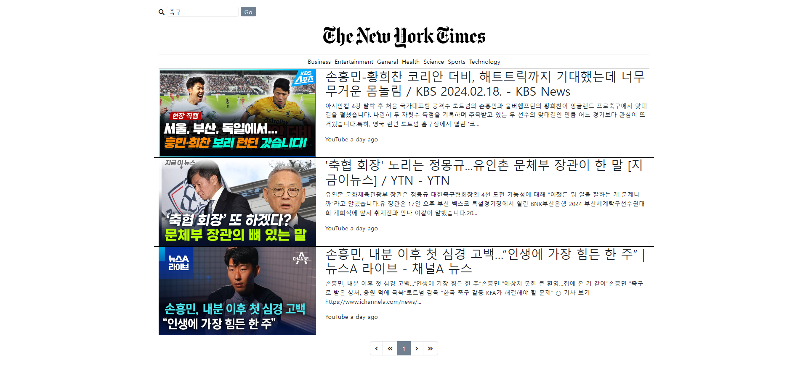

  

  <strong>뉴스 타임즈</strong>
   
  News API를 사용해서 카테고리 & 키워드 검색 시 해당 뉴스를 가져오는 프로젝트 입니다.

 
 

# 💡 프로젝트 분석

  <strong>News API를 사용해서 카테고리 & 키워드 검색 시 해당 뉴스를 가져오는 프로젝트 입니다.</strong>

1. API를 통해 최신 뉴스를 가져오는 함수를 만듭니다.
2. 뉴스를 보여주는 함수를 만듭니다.
3. 메뉴를 클릭했을 때 해당 카테고리에 맞는 뉴스를 보여줍니다.
4. 키워드로 검색했을 때 해당 키워드에 맞는 뉴스를 보여줍니다.
5. 코드 리팩토링을 통해 반복되는 코드들을 보다 간결하게 재작성 합니다.
6. try-catch 구문을 통해 에러 처리 및 에러 핸들링을 합니다.
7. 페이지네이션의 특징을 파악한 후, 페이지네이션을 그려주는 함수를 만듭니다.
8. 페이지 번호 클릭 시 해당 페이지를 보여주는 함수를 만듭니다.
9. << >> 제일 처음 & 끝으로 가는 버튼과 기능을 추가합니다.
10. 검색 아이콘 클릭 시 input과 button이 보여지고, 한번 더 클릭하면 숨김처리 됩니다.
11. 미디어 쿼리를 사용해서 화면 크기가 600px 이하일 경우, 햄버거 버튼이 보여지게 됩니다.
12. 만약 뉴스에 대한 내용이 없을 경우, "내용 없음" 텍스트로 대체합니다.
13. 만약 뉴스에 대한 내용의 길이가 200자 이상일 경우, 말줄임표로 대체합니다.
12. 만약 뉴스에 대한 이미지가 없을 경우, "no Image" 이미지로 대체합니다.
13. 만약 뉴스에 대한 출처가 없을 경우, "no source" 텍스트로 대체합니다.
14. 날짜를 현재로부터 몇 시간 전인지에 대해 표현하기 위해 moment.js 오픈소스 라이브러리를 사용해서 보여줍니다.

 
 

# 📍 리팩토링 시 추가 & 수정해야 할 부분
1. 페이지네이션 - 처음과 끝 pageGroup의 화살표 없애기
2. 페이지 수가 5개 이하일 경우 또는 마지막 페이지 그룹이 5개 이하일 경우 - 해당 페이지에 맞춰서 보여주기
3. 최상단 title 부분 fixed로 고정시키기
4. 반응형일 경우 메뉴 숨기기 (사이드 메뉴로 대체)
