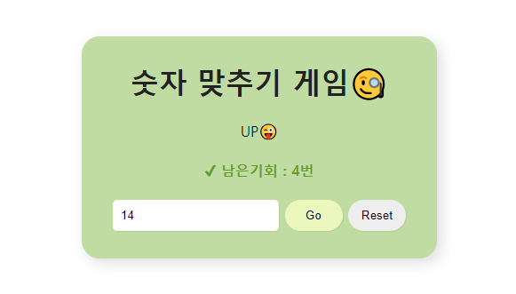

🔗[sb-number-guess-game.netlify.app/](sb-number-guess-game.netlify.app/)

  

  <strong>숫자 맞추기 게임</strong>
   
  술게임과 같은 숫자 맞추기 게임! 5번 안에 숫자를 맞춰보세요.

 
 

# 💡 프로젝트 분석

  <strong>반복문과 조건문을 이용한 간단한 콘솔게임 입니다.</strong>

1. 랜덤번호를 지정합니다.
2. 유저는 번호를 입력한 후, Go 버튼을 누릅니다.
3. 만약에 유저가 랜덤번호를 맞추면 "정답!"
4. 랜덤번호가 유저번호보다 작으면 "Down!"
5. 랜덤번호가 유저번호보다 크면 "Up!"으로 각각의 상황에 맞게 텍스트를 변경되면서 기회가 깎입니다.
6. Reset 버튼을 누르면 게임이 리셋됩니다.
7. 5번의 기회를 다쓰면 게임이 끝나면서 더이상 게임이 진행이 되지 않고 버튼이 disabled가 됩니다.
8. 유저가 1~100 범위 밖의 숫자를 입력하면 알려주고, 기회를 깎지 않습니다.
9. 유저가 이미 입력한 숫자를 또 입력하면 알려주고, 기회를 깎지 않습니다.
