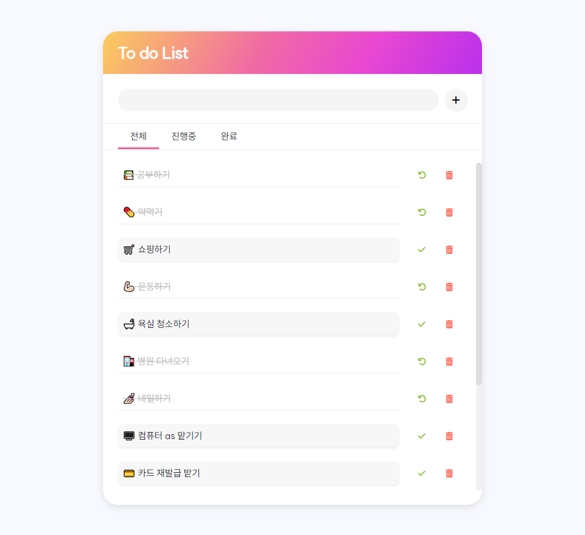

  

  <strong>To do List</strong>
   
  할 일을 추가 & 삭제 및 탭을 이용해 상태 별로 나눠서 볼 수 있는 투두리스트 입니다.

 
 

# 💡 프로젝트 분석

  <strong>각각의 리스트마다 랜덤 ID값을 부여해서 그에 맞는 리스트를 찾아 실행되는 프로젝트 입니다.</strong>

1. 유저가 값을 입력합니다.
2. 추가버튼을 클릭하면 할 일이 추가됩니다.
3. 각 할 일에 삭제와 체크버튼이 있습니다.
4. 삭제버튼을 클릭하면 할 일이 리스트에서 삭제됩니다.
5. 체크버튼을 누르면 할 일이 끝난 것으로 간주되고 밑줄이 그어집니다.
   - check 버튼을 클릭하는 순간 true false
   - true이면 끝난 것으로 간주하고 밑줄이 보여집니다.
   - false이면 안끝난 것으로 간주하고 그대로 보여집니다.
6. 탭을 누르면 언더바가 자연스럽게 이동됩니다.
7. 탭을 이용해 아이템들을 상태별로 나누어서 볼 수 있습니다.
8. 끝난 할 일은 되돌리기 버튼을 클릭하면 다시 되돌릴 수 있습니다.
9. 리스트가 넘칠 경우, 자동으로 스크롤바가 생성됩니다.
10. 모바일 버전에서도 확인할 수 있는 반응형 웹이어야 합니다.
